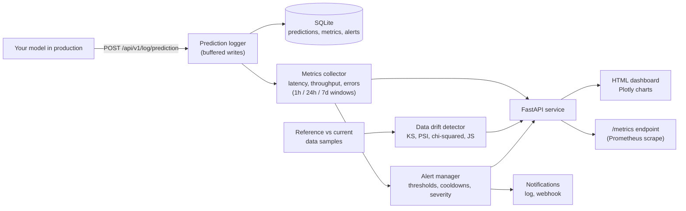

# ML Monitoring Dashboard

A monitoring service for machine learning models in production. You send it the
predictions your model makes, and it tracks how the model behaves over time:
how fast it responds, how often it errors, what it predicts, and whether the
data coming in has started to look different from the data the model was built
for. It exposes this through a JSON API, a Prometheus metrics endpoint, and a
single HTML dashboard you can open in a browser.

It runs with no API keys and starts in demo mode, so you can open the dashboard
and see populated charts within a minute of cloning the repo.

## What problem this solves

A model that works well on the day you deploy it can quietly get worse. The
world changes, user behavior changes, and the live data stops resembling the
data the model learned from. The model keeps returning answers with full
confidence, so nothing looks wrong until someone notices the results are off.

This service watches for that. It records every prediction, computes
performance metrics over rolling time windows, and checks whether the incoming
data has drifted away from a known reference. When a measured value crosses a
threshold, it raises an alert.

## What "data drift" means, in plain language

Suppose you train a fraud model when the average transaction is 50 dollars.
Months later the typical transaction is 64 dollars and more people are paying
from phones. The model was never retrained, so it is now judging a world it has
not seen. That shift in the input data is data drift.

To measure it, the service keeps a reference sample (what the data used to look
like) and compares it against a current sample (what the data looks like now),
one feature at a time:

- For numeric features such as transaction amount, it uses the
  Kolmogorov-Smirnov test, the Population Stability Index (PSI), and Wasserstein
  distance. These ask whether the two distributions have the same shape and how
  far apart they are.
- For categorical features such as device type, it uses a chi-squared test and
  Jensen-Shannon divergence. These ask whether the category proportions have
  changed.

Each feature gets a drift score. A higher score means a bigger shift. Features
past the threshold are flagged as drifted, and the per feature scores are drawn
as a heatmap on the dashboard.

## Architecture and data flow



Predictions arrive at the API and are buffered to SQLite while the metrics
collector aggregates them in memory over sliding time windows. The drift
detector compares a reference data sample against a current one. The API reads
from these pieces and serves three things: the HTML dashboard, the JSON
endpoints, and a Prometheus metrics endpoint. The alert manager checks metrics
against rules and can notify by log or webhook.

## Run it locally with Docker

From the repository root:

```bash
# Dashboard only (fastest, no extra images to pull):
docker compose -f docker/docker-compose.yml up -d --no-deps api
#   open http://localhost:8210/

# Full stack (also starts Prometheus and Grafana, pulls their images once):
make docker-up
#   dashboard:  http://localhost:8210/
#   API docs:   http://localhost:8210/docs
#   Prometheus: http://localhost:9210
#   Grafana:    http://localhost:3210  (login admin / admin)

# Stop and remove containers:
docker compose -f docker/docker-compose.yml down
```

The ports (8210, 9210, 3210) are chosen so this stack does not collide with
other local projects. The compose project is named `ml-monitoring-dashboard`.

The service starts in demo mode by default (`ML_MONITOR_DEMO_MODE=true`). On
startup it registers a synthetic `demo-fraud-classifier` model, feeds the
metrics collector a sample of predictions, and computes a real drift report
over sample reference and current distributions. This is clearly labelled
sample data, not real production traffic, and it exists so the charts render
with content. Set `ML_MONITOR_DEMO_MODE=false` to start with an empty system.

To check it is up:

```bash
curl http://localhost:8210/health
# {"status":"healthy","version":"1.0.0"}
```

### Without Docker

```bash
pip install -e ".[dev]"
make run
#   dashboard: http://localhost:8000/
#   API docs:  http://localhost:8000/docs
```

## What the dashboard shows

Open `http://localhost:8210/`. A yellow banner at the top states that the data
is synthetic demo data. Below it is a header with the model name and the overall
drift score, a row of summary numbers (total predictions, peak P99 latency, peak
error rate, drift status), and five charts laid out to fit one screenshot:

1. Prediction latency over time. The P50, P95, and P99 response times across the
   last 24 hours, with a visible congestion bump in the evening.
2. Request throughput. Requests per second following a daily usage curve.
3. Error rate. The error percentage over time with a dashed threshold line, and
   a spike that rises above the 5 percent threshold.
4. Prediction distribution. A bar chart of how many predictions fell into each
   label (legitimate vs fraud).
5. Feature drift heatmap, full width. One colored cell per feature, where color
   reflects the drift score. In the demo, transaction amount and session minutes
   show clear drift while account age and items per order stay stable.

The charts are drawn with Plotly and resize to their containers.

## API reference

All endpoints are served by the FastAPI app. Interactive docs are at `/docs`.

| Method | Endpoint | Description |
|--------|----------|-------------|
| GET | `/` and `/dashboard` | HTML dashboard with the Plotly charts |
| POST | `/api/v1/log/prediction` | Log a model prediction |
| POST | `/api/v1/log/ground-truth` | Attach a later actual value to a prediction |
| GET | `/api/v1/metrics/{model}` | Metrics summary for a model over a window |
| GET | `/api/v1/drift/{model}` | Data drift report for a model |
| GET | `/api/v1/alerts` | List active alerts |
| POST | `/api/v1/alerts/{id}/acknowledge` | Acknowledge an alert |
| GET | `/api/v1/dashboard/{model}` | Dashboard data as JSON |
| GET | `/api/v1/report/{model}` | Generate a daily or weekly report (JSON) |
| GET | `/api/v1/models` | List registered models |
| GET | `/api/v1/system` | CPU, memory, GPU, and disk usage |
| WS | `/ws/live` | Stream system metrics every 2 seconds |
| GET | `/health` | Health check |
| GET | `/metrics` | Prometheus metrics |

## What else is in the codebase

The dashboard and the `/api/v1/drift` endpoint surface data drift. The
repository also includes these components, with unit tests, that you can call
from your own code or wire into a scheduled job:

- Model drift detection: Page-Hinkley and ADWIN change detection for spotting a
  decline in accuracy over a stream.
- Anomaly detection: z-score, interquartile range, and rolling average methods
  for latency, error, and volume spikes.
- Alerting: rule based with configurable thresholds, cooldowns, and severity
  levels. Notifications go to the log and to a webhook. Email is a placeholder.
- Reports: a daily or weekly report that can render as JSON, Markdown, or HTML.

## Tech stack

- API: FastAPI and Uvicorn
- Storage: SQLAlchemy with aiosqlite (SQLite by default, ready for PostgreSQL)
- Charts: Plotly, rendered in a single HTML page
- Metrics export: prometheus-client, with Prometheus and Grafana in the compose file
- Statistics: NumPy, SciPy, scikit-learn, and pandas
- Tests: pytest and pytest-asyncio (146 tests)

## Development

```bash
make dev          # install with dev dependencies
make test         # run the test suite
make coverage     # run tests with a coverage report
make lint         # run the linter
make typecheck    # run the type checker
```

## License

MIT
